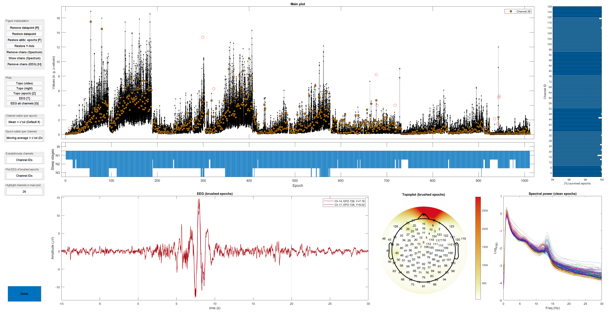
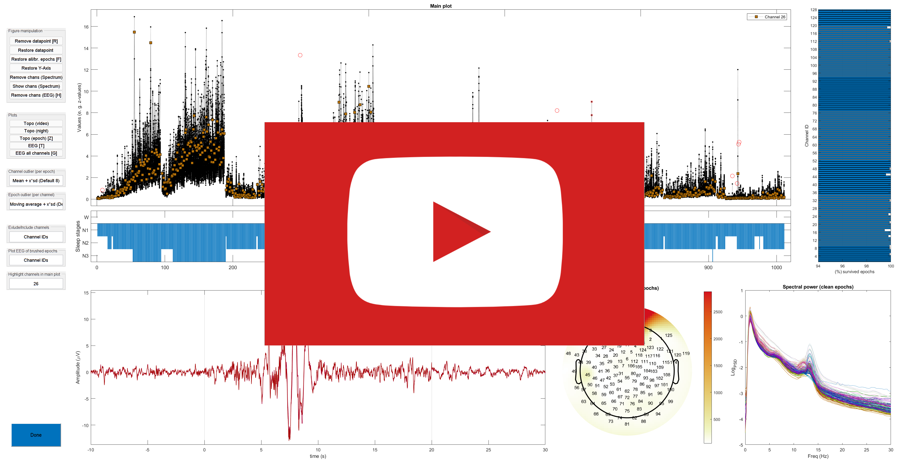

# What this repository is about
This is a new, semi-automatic artifact removal routine specifically designed for sleep hd-EEG recordings. By employing a graphical user interface (GUI), the user assesses epochs in regard to four sleep quality markers (SQMs). Based on their topography and underlying EEG signal, the user eventually removes artifactual values. To identify artifacts, the user is required to have basic knowledge of (patho-)physiological and artifactual EEG. The final output consists of a binary matrix (channels x epochs). Channels affected by artifacts can be restored in afflicted epochs using epoch-wise interpolation, a function included in the online repository.

### Screenshot of the GUI

# How to use it
1. Open `Configuration_OutlierGUI.m` and adjust the parameters according to your data (number of channels, scoring lenth, stages to include, etc.).
2. Run `Call_OutlierGUI.m`. This script will ask you to load the EEG data. Optionally, you can further load 1) the corresponding sleep scoring, 2) perviously rejected artifacts, and 3) manually rejected epochs typically performed during sleep scoring. Then the artifact removal routine begins. In total, each night is screened eight times for artifacts, each time based on a different SQM. The screening of one night takes approximately 10 to 60 minutes, depending on the length and quality of the data, as well as the experience of the user.

## The artifact removal routine
Each value in the summary plot corresponds to one epoch for a given channel. Consequently, outlier values correspond to an artifactual EEG signal from one channel in a given epoch. Outlier values are identified based on four sleep-related SQMs in the following order: 1) delta power (normalized), 2) beta power (normalized), 3) the maximum squared deviation in amplitude from the average EEG signal, and, 4) delta power (raw). All four SQMs are computed from EEG data with original reference (EEG signal referenced as during recording), as well as from average referenced EEG data. Hence, the artifact removal routine is repeated eight times. The first four times, the user iterates through all four SQMs from EEG data with original reference, thereafter through all four SQMs from average referenced EEG data. During each iteration, outlier values are identified and possible artifacts detected. 

## The output
As a final result, the artifact removal routine provides a matrix (channels x epochs) containing 0s and 1s, where 0 denotes that a certain channel contained artifacts or did not belong to the sleep stage of interest, and 1 indicates that a certain channel is artifact-free and within the sleep stage of interest.

## Data format
Currently, the EEG needs to be stored in a `.mat file`, storing a common [EEGLAB structure](https://eeglab.org/tutorials/ConceptsGuide/Data_Structures.html#eeg-and-alleeg) with `EEG.srate` and `EEG.data` as fields that contain the sampling rate and EEG data, respectively. The latter stores the EEG signal as a matrix (channels x samples). The function `makeEEG()` converges EEG data into an EEGLAB structure and is included in the online repository. Sleep stages need to be stored in a vector of numbers or letters, where a distinct number or letter corresponds to a certain sleep stage. Supported data formats currently include `.mat`, `.txt` and `.vis` files.  A short example dataset (64 channels, one sleep cycle) is included in the online repository.

### Example video

